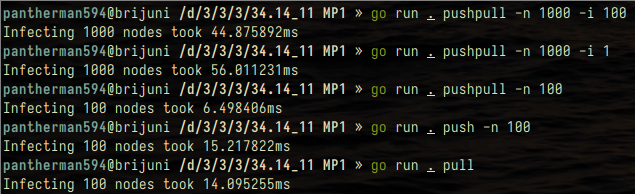
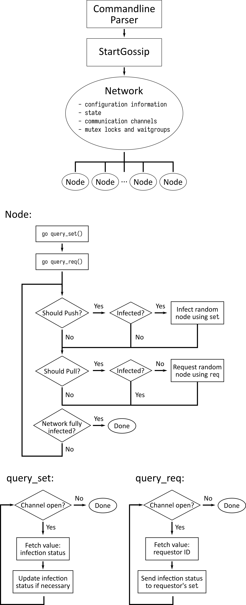

gogossip
=====

_Gossip simulator_

David Shen, Jack Wiseman, Joon Park

Usage
-----

In a terminal, run:

`go run . [push|pull|pushpull] [-n nodes] [-i infected] [-v]`

Example runs
------------

Description
-----------

**gogossip** uses goroutines to simulate push, pull, and push-pull gossip
algorithms with a configurable number of nodes and initially infected nodes.

Options
-------

#### -h, --help

Displays help with available flag, subcommand, and positional value parameters.

#### -n _nodes_, --nodes nodes

Sets the number of nodes in the network. (default: 100)

#### -i _infected_, --infected _infected_

Sets the number of initially infected nodes in the network. (default: 1)

#### -v, --verbose

Print additional transmission information for debugging.

Commands
--------

#### push

Use the "push" gossip algorithm. In each round, each infected node attempts to
infect one random node.

#### pull

Use the "pull" gossip algorithm. In each round, each susceptible node attempts
to retrieve infection from one random node.

#### pushpull

Use the "push-pull" gossip algorithm. In each round, each infected node attempts
to infect one random node. Then, each susceptible node attempts to retrieve
infection from one random node.

How it works
------------

### Overview

### Files

#### main.go

[main.go](main.go) is the main command file. Its sole purpose is to parse commandline arguments
and forward them to [gossip.go](gossip.go).

#### gossip.go

[gossip.go](gossip.go) sets up and times a gossip simulation. It creates
communication channels for each node in the network, sets the network
configuration based on the options passed, and creates all the nodes and starts
their gossip goroutines. When all the nodes are infected, it prints out the
duration and closes all the channels.

#### network.go

[network.go](network.go) handles the gossip network that all the nodes are on.
It defines a `Bichan` struct, which provides the bidirectional set and request
channels for pushing and pulling infection. It also defines a `Network` struct,
which stores the configuration and current state of the network. It also has an
`increment_infected` method, which increments the number of infected nodes and
checks whether the network is fully infected, while enforcing a mutex lock to
avoid race conditions.

#### node.go

[node.go](node.go) controls the actions of each individual node. It defines a
`node` struct, which contains the current state of the node, as well as the
network it is connected to.

It has methods `infect_other` and `request_other`, to attempt to either push
infection to or pull infection from a specified node through their respective
channels. This is done within a select/case statement, which allows the channel
communication to be non-blocking. These two methods return whether the push/pull
was successful.

It also has methods `query_set` and `query_req`. These constantly poll the set
and req channels for the current node for new messages. If a message is received
in the set channel, the node updates its infection status. If a message is
received in the req channel, the receiving node sends an infection to the
requestor if the recipient is infected.

The `Gossip` method starts the two queries in goroutines, and loops through the
gossip algorithm until the network is fully infected. If push is enabled and the
node is infected, it attempts to infect some other random node using
`infect_other`. If pull is enabled and the node is not infected, it attempts to
request the infection status from some other random node using `request_other`.

#### flaggy

Flaggy was cloned from [integrii/flaggy](https://github.com/integrii/flaggy),
but modified to return an error if parsing fails. This lets us show an error
message if a flag is not parsed correctly.
